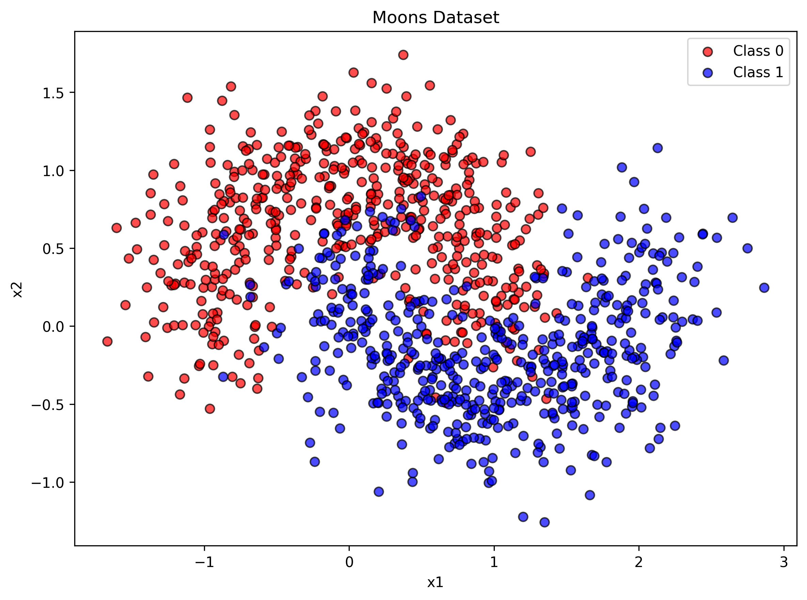
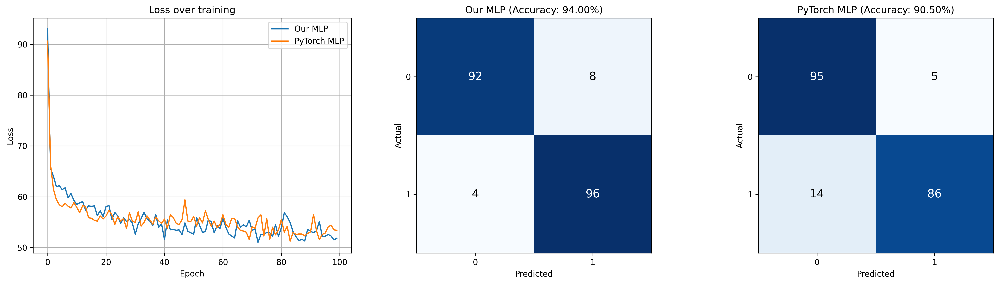

# Output

### Data to Classify (Moon Dataset)


### Error Graph and Confusion Matrix


# Prepare environment
### Create virtual environment
```bash
python -m venv venv
```

### Windows git bash
```bash
source venv/Scripts/activate
```

### macOS/Linux
```bash
source venv/bin/activate
```

### Install requirements
```bash
pip install -r requirements.txt
```

### Save dependencies
```bash
pip freeze > requirements.txt
```

### Deactivate
```bash
deactivate
```

# Running tests
```bash
source venv/Scripts/activate
pip install -r requirements.txt
bash run_tests.sh
```

# Running Evaluation.py
```bash
source venv/Scripts/activate
pip install -r requirements.txt
bash run_evaluate.sh
```

# VS Code tips
### Opening markdown preview 
`Ctrl + Shift + V`

### Opening both markdown preview side by side with source file
`Ctrl + K V`


# Insights

### Activation Functions

| Function | Output Range | Pros | Cons | Recommendations |
|----------|-------------|------|------|-----------------|
| Sigmoid | (0, 1) | Outputs probabilities | Vanishing gradient, not zero-centered | Normalize inputs (e.g. 0-1), use proper weight initialization (Xavier), avoid in deep hidden layers |
| Tanh | (-1, 1) | Zero-centered, stronger gradients than sigmoid | Vanishing gradient (saturates at -1 and 1) | Normalize inputs (e.g. -1 to 1), use proper weight initialization (Xavier), avoid in deep hidden layers |
| ReLU | [0, inf) | No vanishing gradient, computationally fast | Dying ReLU (neurons stuck at 0), exploding gradients | Use He initialization, consider batch normalization |
| Leaky ReLU | (-inf, inf) | No dying ReLU, no vanishing gradient | Exploding gradients | Use He initialization, consider batch normalization |

### Vanishing Gradient Problem

When activation functions like sigmoid or tanh saturate (output near their min/max), their gradients become near zero. During backpropagation, gradients multiply through each layer. If each layer produces a small gradient, the product shrinks exponentially as it flows backward:

```
Layer 5: 0.1
Layer 4: 0.1 x 0.1 = 0.01
Layer 3: 0.01 x 0.1 = 0.001
Layer 2: 0.001 x 0.1 = 0.0001
Layer 1: 0.0001 x 0.1 = 0.00001
```

Earlier layers barely update, so the network stops learning. ReLU-based functions avoid this because their gradient is either 0 or 1, preventing the gradient from shrinking as it propagates back.
